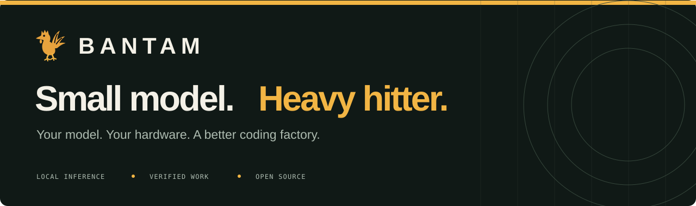
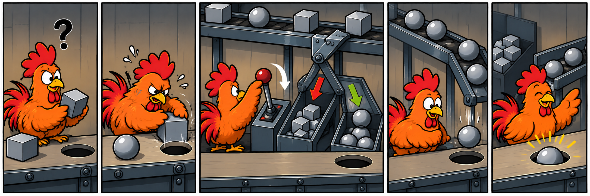

<p align="center">
  <a href="https://bantam-admin.github.io/bantam-factory/">
    
  </a>
</p>

<p align="center">
  <strong>Your model is the worker. Give it a factory.</strong><br>
  An open source coding factory that can improve its own machinery.
</p>

<p align="center">
  <a href="#quick-start"><strong>Get started</strong></a> ·
  <a href="https://bantam-admin.github.io/bantam-factory/fights.html"><strong>Watch the fights</strong></a> ·
  <a href="https://bantam-admin.github.io/bantam-factory/assets/showcase/examples/tetris/index.html">Play what it built</a> ·
  <a href="docs/README.md">Docs</a> ·
  <a href="CONTRIBUTING.md">Contribute</a>
</p>

<p align="center">
  <a href="LICENSE"></a>
  <a href="docs/GETTING-STARTED.md"></a>
</p>

Give BANTAM FACTORY a job: build an app, fix a stubborn bug, automate the boring part.
It brings your model the tools, context, and checks to get the work done.
Run a local 27B, or put **Codex Astra, Sol, or Terra** inside the factory.

The factory formula: **turn big jobs into chicken problems**. Put the model at
one station at a time—as worker, reviewer, or test builder. The factory runs
the checks, feeds back the result, and directs the next repair or delivery.

## Get more from Codex.

**Your Codex account. Same Astra. More work from your tokens.**
Connect your signed-in Codex CLI during setup. The factory gives Astra focused
context, reusable tools, and checks that guide the next step.

Astra inside BANTAM FACTORY vs. Astra in native Codex:

| Job | Less input | Less output | Less time | See the work |
| --- | --- | --- | --- | --- |
| **Context packer** | **46%** | **18%** | **18%** | [Round 1 ↗](https://bantam-admin.github.io/bantam-factory/codex/context-packet-astra-context-1/share/index.html) · [Round 2 ↗](https://bantam-admin.github.io/bantam-factory/codex/context-packet-astra-context-2/share/index.html) |
| **Snapshot checker** | **35%** | **14%** | **12%** | [Replay ↗](https://bantam-admin.github.io/bantam-factory/codex/snapshot-drift-qualified-4/share/index.html#card=snapshot-drift&view=results&layout=compare&left=bantam-codex-astra&right=codex-astra) |
| **Job planner** | **44%** | **25%** | **21%** | [Round 5 ↗](https://bantam-admin.github.io/bantam-factory/codex/job-planner-codex-5/share/index.html) · [Round 6 ↗](https://bantam-admin.github.io/bantam-factory/codex/job-planner-codex-6/share/index.html) |

Same task, starting files, and medium reasoning effort within each comparison.
Every run passed all five independent acceptance groups. Context packer and
job planner combine two paired repeats; snapshot checker is one pair.
Open a replay for every action, delivered file, check, and token counter.
Prefix-cache tokens are included in input. Job planner reused **73,472**
prefix-cache tokens across the two factory runs; uncached input was
**22,760 vs. 25,860** in native Codex—**12% less uncached input**.

<details>
<summary>Sol and Terra work here, too.</summary>

On the Context Packet task, factory Sol finished **1.8× faster with 44% less
input** across two pairs ([round 1](https://bantam-admin.github.io/bantam-factory/codex/context-packet-sol-1/share/index.html),
[round 2](https://bantam-admin.github.io/bantam-factory/codex/context-packet-sol-2/share/index.html)).
Factory Terra finished **2.3× faster with 73% less input** in
[one recorded pair](https://bantam-admin.github.io/bantam-factory/codex/context-packet/share/index.html#card=context-packet&view=results&layout=compare&left=bantam-codex-terra&right=codex-terra).
All passed the same five acceptance groups at medium effort.

</details>

**[Play what Astra built →](https://bantam-admin.github.io/bantam-factory/assets/showcase/examples/arcade/index.html)**
Same brief. Two playable games. Compare the factory and native CLI builds.

<p align="center">
  
</p>

## Same model. Bigger punch.

Same task. Same local Qwen 27B. Both systems passed in each comparison below.

The local rig: **one RTX 4090 · 24 GB**. BANTAM FACTORY's recorded generation speed
across the published cards: **82.6–105.2 tokens/second**.

| BANTAM FACTORY vs. | Faster completion | Fewer input tokens | Watch the fight |
| --- | --- | --- | --- |
| **Pi** | **6.0×** | **74%** | [Context Packet ↗](https://bantam-admin.github.io/bantam-factory/context-packet/share/index.html#card=context-packet&view=results&layout=compare&left=bantam-local-27b&right=pi) |
| **Hermes** | **8.8×** | **≥69%** | [Context Packet ↗](https://bantam-admin.github.io/bantam-factory/context-packet/share/index.html#card=context-packet&view=results&layout=compare&left=bantam-local-27b&right=hermes) |
| **DeepSeek Harness** | **3.9×** | **47%** | [Receipt Reducer ↗](https://bantam-admin.github.io/bantam-factory/receipt-reducer/share/index.html) |
| **OpenCode** | **6.8×** | **73%** | [Patch Transaction ↗](https://bantam-admin.github.io/bantam-factory/patch-transaction/share/index.html#card=patch-transaction&view=results&layout=compare&left=bantam-local-27b&right=opencode) |

These are highlights from recorded development tasks. Open a card for every
contender, the checks, and the run conditions.
Hermes' token saving is a lower bound: 18 of its 19 requests have token counters.

The little model can trade punches with frontier agents, too:
[Context Packet](https://bantam-admin.github.io/bantam-factory/context-packet/share/index.html)
took **58.1s locally vs. 110.6s in native Codex/Astra**, both 5/5.

**[Enter the fight gallery →](https://bantam-admin.github.io/bantam-factory/fights.html)**
Pick a task. Put agents side by side. Read how it went. Inspect every recorded
action and the files they delivered.

**[Try a tool the factory built in 58 seconds →](https://bantam-admin.github.io/bantam-factory/context-packet/share/index.html#try-it)**

## What can it do?

- **Build what you need.** Features, tools, scripts, fixes, and tests.
- **Check and repair.** Use real test results to guide the next attempt.
- **Make the next job easier.** Build reusable tools for the work you keep doing.
- **Put your hardware to work.** Run a local model, or bring your Codex account.

**Let Astra supervise.** Watch it direct a Terra or Sol worker on the
[context packer](https://bantam-admin.github.io/bantam-factory/codex/context-packet-qualified-1/share/index.html)
or [stream decoder](https://bantam-admin.github.io/bantam-factory/codex/stream-framer-qualified-1/share/index.html).
Both models' work and tokens are included.

<a id="start-with-what-you-already-have"></a>

## Quick start

<a id="platforms"></a>

**Linux / WSL2 · Node.js 20+ · Git · Docker**

```bash
git clone https://github.com/BANTAM-ADMIN/bantam-factory.git
cd bantam-factory
npm ci
docker pull alpine:3
npm link
bantamfactory setup
```

Setup connects your model server or installed Codex CLI. Need a local model?
It also offers a guided download for supported NVIDIA GPUs.

Then open your project:

```bash
cd /path/to/your/project
bantamfactory --verify "npm test"
```

Tell it what you want:

> Add dark mode. Remember my choice. Make sure the tests pass.

Use your project's test command in place of `npm test`.
[Installation help](docs/GETTING-STARTED.md) · [Models & hardware](docs/FIRST-RUN-SETUP.md)

## Use the factory to improve the factory.

BANTAM FACTORY records recurring friction. Its experimental self-improvement workflow
can study those signals, build a change to BANTAM FACTORY, and test its own work before
adopting an eligible improvement. You choose when to run that cycle.

**Better tools. Fewer repeated mistakes. A better-equipped factory.**
[Try self-improvement →](docs/SELF-IMPROVEMENT.md)

## Put it in the ring.

Give it a task worth solving. Watch the work. Bring competitors to the same
task and see what the harness changes.

[Run your own cards →](docs/BRING-YOUR-OWN-COMPARISONS.md)

Bring a task, a bug, or a better idea for the factory.
**[Contributions welcome →](CONTRIBUTING.md)**

[How the factory works](docs/FACTORY-MODEL.md) · [All docs](docs/README.md) · [Security](SECURITY.md) · [Apache-2.0](LICENSE)
