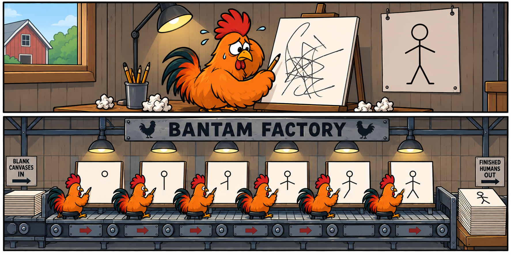
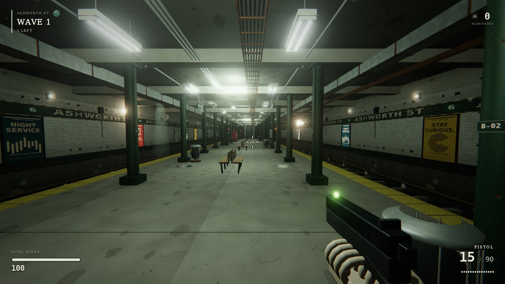

<p align="center">
  <a href="https://bantam-admin.github.io/bantam-factory/">
    
  </a>
</p>

<p align="center">
  <strong>Get more from Codex. Give your model a factory.</strong><br>
  Same Astra. Less waste. Finished work you can inspect.
</p>

<p align="center">
  <a href="#get-started"><strong>Get started</strong></a> ·
  <a href="https://bantam-admin.github.io/bantam-factory/fights.html"><strong>Watch the fights</strong></a> ·
  <a href="https://bantam-admin.github.io/bantam-factory/#builds"><strong>Play the builds</strong></a> ·
  <a href="docs/README.md">Docs</a>
</p>

BANTAM FACTORY is an open source coding factory. Put **Codex Astra** inside it,
or run a **local 27B on your own GPU**. Give it a job in plain language:
build an app, fix a bug, automate the boring part.

A harness for Codex. A factory for your local model. A fight card that lets
you see the difference.

## Your Codex account. More work from your tokens.

The same Astra completed these jobs with fewer tokens and less time inside
BANTAM FACTORY than in native Codex:

| Job | Less input | Less output | Less time | Inspect the work |
| --- | --- | --- | --- | --- |
| **Plan dependent jobs** | **44%** | **25%** | **21%** | [Two recorded pairs ↗](https://bantam-admin.github.io/bantam-factory/codex/job-planner-codex-5/share/index.html) · [second pair](https://bantam-admin.github.io/bantam-factory/codex/job-planner-codex-6/share/index.html) |
| **Pack project context** | **46%** | **18%** | **18%** | [Two recorded pairs ↗](https://bantam-admin.github.io/bantam-factory/codex/context-packet-astra-context-1/share/index.html) · [second pair](https://bantam-admin.github.io/bantam-factory/codex/context-packet-astra-context-2/share/index.html) |
| **Check changed files** | **35%** | **14%** | **12%** | [Replay ↗](https://bantam-admin.github.io/bantam-factory/codex/snapshot-drift-qualified-4/share/index.html) |

Same task, starting files, and medium reasoning effort within each comparison.
All passed five independent acceptance groups. The paired results combine both
repeats. Job planner also used **12% less uncached input**. Prefix-cache tokens
are included in input; each card shows the complete counters and conditions.

**Less context to carry. More room for the work.** Open a fight to follow every
action, read the tests, and inspect what each harness delivered.

## Don't just watch. Play it.

**A design becomes a world you can walk into.**

[](https://bantam-admin.github.io/bantam-factory/assets/showcase/examples/ashworth/index.html)

**ASHWORTH ST · Last Stop.** Astra inside BANTAM FACTORY built a 3D subway
survival game from a detailed design: a moving train, animated enemies,
three weapons, procedural textures and sound. Explore the station. Survive
the passengers. Play the preview in your browser.

**[Play ASHWORTH ST →](https://bantam-admin.github.io/bantam-factory/assets/showcase/examples/ashworth/index.html)**
· [Explore the source](site/examples/ashworth/game)
· [Download the game](https://bantam-admin.github.io/bantam-factory/assets/showcase/examples/ashworth/ashworth-st.zip)

Desktop · keyboard + mouse. The factory is still refining this build;
the published preview includes its snapshot and browser-check record.

**Same Astra. Same puzzle brief. Two harnesses.**

> Make me a beautiful, complete falling-block puzzle game in one self-contained HTML file.

Factory Astra built **Moonstack in 5m 57s**: hold, ghost landing, combos,
levels, saved best score, and keyboard and touch controls. One preview action
checked desktop and two phone sizes, caught a keyboard-focus bug, and sent
Astra back to repair it. The finished game has **13 passing tests**.

Against the saved native Astra baseline: **78% less input, 9% less output,
and 12% less time**, with **5% less uncached input**. Eight Astra calls in
the factory; 19 in native Codex. Both delivered playable games. The page
includes both recordings, retained tests, and independent browser playtests.

**[Play factory Astra · native Astra · local 27B →](https://bantam-admin.github.io/bantam-factory/assets/showcase/examples/arcade/index.html)**

Three clearly labelled builds. Each has its own prompt, clock, actions, and
original downloadable file. The local game came from a shorter prompt.

## The factory formula: chicken problems.

Big jobs become small jobs the model can finish and check. Stations give it
the right context and tools, run the checks, and feed back the next repair.
The model can work, review, and build tests. Reusable tools become the factory's
jigs; guards catch recurring mistakes before they spread.

- **Build it. Check it. Improve it.** Actual test results guide the next step.
- **Check desktop and phone together.** One browser-preview action can exercise three screen sizes and return each result, so Astra can fix the layout with fewer trips back and forth.
- **Keep the work contained.** Project file boundaries and Docker shell isolation; shell networking is off by default.
- **Improve the machinery.** The experimental [self-improvement loop](docs/SELF-IMPROVEMENT.md) studies recorded friction, builds changes, and tests them before eligible promotion. You choose when to run it.

[See the factory at work →](https://bantam-admin.github.io/bantam-factory/)

## Small model. Heavy hitter.

Local Qwen 27B on **one RTX 4090 · 24 GB VRAM**.
Recorded generation speeds: **82.6–105.2 tokens/second**.

| Same model inside… | Factory finished | Fewer input tokens | Fight |
| --- | --- | --- | --- |
| **Pi** | **6.0× faster** | **74%** | [Context packer ↗](https://bantam-admin.github.io/bantam-factory/context-packet/share/index.html#card=context-packet&view=results&layout=compare&left=bantam-local-27b&right=pi) |
| **Hermes** | **8.8× faster** | **≥69%** | [Context packer ↗](https://bantam-admin.github.io/bantam-factory/context-packet/share/index.html#card=context-packet&view=results&layout=compare&left=bantam-local-27b&right=hermes) |
| **OpenCode** | **6.8× faster** | **73%** | [Patch transaction ↗](https://bantam-admin.github.io/bantam-factory/patch-transaction/share/index.html#card=patch-transaction&view=results&layout=compare&left=bantam-local-27b&right=opencode) |
| **DeepSeek Harness** | **3.9× faster** | **47%** | [Receipt reducer ↗](https://bantam-admin.github.io/bantam-factory/receipt-reducer/share/index.html) |

Selected recorded fights; both contenders passed each job. Hermes' saving is
at least 69% because one of its 19 requests lacks token counters.

## Get started

<a id="quick-start"></a><a id="platforms"></a><a id="start-with-what-you-already-have"></a>

**Linux / WSL2 · Node.js 20+ · Git · Docker**

```bash
git clone https://github.com/BANTAM-ADMIN/bantam-factory.git
cd bantam-factory
npm ci
docker pull alpine:3
npm link
bantamfactory setup
```

Setup connects your signed-in Codex CLI or local model. To use Astra, open a project:

```bash
cd /path/to/your/project
bantamfactory --codex --model gpt-6-astra
```

Then ask for the work. Your existing Codex account works here; no local GPU is
needed for Astra. Sol and Terra are supported too.

[Installation help](docs/GETTING-STARTED.md) · [Local models & hardware](docs/FIRST-RUN-SETUP.md)

## Bring your harness. Put it in the ring.

Same task. Same starting files. Side-by-side work, checks, tokens, and clocks.
Register Codex, Hermes, OpenCode, Pi, or DeepSeek Harness and run your own fights.

**[Run your own cage match →](docs/BRING-YOUR-OWN-COMPARISONS.md)**

[Contribute](CONTRIBUTING.md) · [How it works](docs/FACTORY-MODEL.md) · [Security](SECURITY.md) · [Apache-2.0](LICENSE) · [Business inquiries](mailto:bantamfactory@gmail.com)
