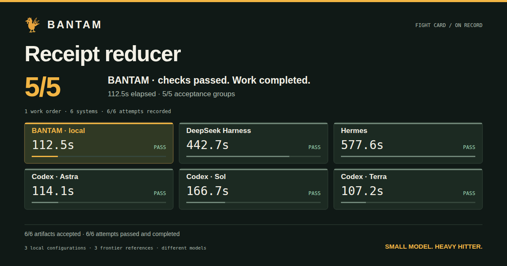

# BANTAM

**Your model. Your hardware. A better coding factory.**

BANTAM turns a local language model into a working coding agent: one that reads
your project, builds features, repairs bugs, runs checks, and leaves evidence
you can inspect. Built to get more speed, accuracy and useful work from the
model you already run—not to sell you another model subscription.

The idea is industrial, not magical. Break difficult work into clear jobs.
Put the right context at each station. Catch mistakes with checks, not wishes.
Verify the result before calling it finished.

**Local work. Frontier backup. Fight cards that show what actually happened.**

[Get started](docs/GETTING-STARTED.md) · [See the fight cards](docs/fights/README.md) ·
[Compare your tools](docs/BRING-YOUR-OWN-COMPARISONS.md) · [System handbook](docs/BANTAM-SYSTEM-HANDBOOK.md)

## Make your local model do real work

Most people do not need another chatbot. They need the feature built, the bug
fixed, and the tests passing. BANTAM is built for that job.

- **Context with a purpose.** Source, tool results, failure evidence and task
  requirements feed the next decision. Factory checks target recurring mistakes
  such as stale verification, unsupported conclusions and missing deliverables.
- **Actions, not just suggestions.** BANTAM uses constrained generation where
  supported, validates actions locally, and executes project commands in Docker
  by default. It can edit your files and run your toolchain.
- **Verification is part of the workflow.** Give BANTAM `npm test`, `pytest`, or
  your own acceptance command. Failures become repair evidence. Strict autonomous
  completion requires the configured checks and applicable completion gates.
- **An auditable factory.** Recorded runs, durable factory events and replayable
  evidence let you examine how the work happened—not just read a confident summary.
- **Built for local speed.** The cache-fast context mode reuses growing prompt
  prefixes with compatible servers. Fight cards expose wall time and token/cache
  accounting so you can measure the benefit on your own machine.

A passing verifier proves what that verifier checked. BANTAM makes that evidence
visible; it does not turn incomplete tests into a guarantee of correctness.

## Don't take the pitch on faith. Watch the fight.

Fight cards put BANTAM and other coding systems on the same work order, with
the same starting files and independent acceptance checks. See the result,
the elapsed time, and the accounting behind it. Then run a comparison yourself.

[](docs/fights/launch-2026-09-07/receipt-reducer/share/index.html)

**Same local 27B. Receipt Reducer: BANTAM 112.5 seconds, DeepSeek Harness
442.7 seconds, Hermes 577.6 seconds. All passed 5/5 and finished cleanly.**
BANTAM used 47.4% fewer input tokens and 69.4% fewer output tokens than DeepSeek.
Native Terra finished in 107.2s, Astra in 114.1s and Sol in 166.7s—all 5/5.
The local factory was close to the fastest frontier result on this work order.
[Inspect every counter and condition](docs/fights/launch-2026-09-07/receipt-reducer/README.md).

More completed work orders, including the misses:

| Work order | BANTAM · local 27B | OpenCode · same 27B | Native Astra |
|---|---:|---:|---:|
| [Build a context packer](docs/fights/launch-2026-09-07/context-packet/README.md) | **58.1s · PASS 5/5** | 600s limit · artifact 5/5, unfinished | 110.6s · PASS 5/5 |
| [Extend a transactional edit engine](docs/fights/launch-2026-09-07/patch-transaction/README.md) | **81.8s · PASS 5/5** | 559.0s · PASS 5/5 | 90.3s · PASS 5/5 |
| [Repair a streaming frame parser](docs/fights/launch-2026-09-07/stream-framer/README.md) | 432.7s · PASS 5/5 | 600s limit · TIMEOUT 0/5 | **160.7s · PASS 5/5** |

Same weights, six systems. The 27B against itself in other harnesses, beside
native Codex Astra, Sol and Terra:

| Work order | BANTAM · local 27B | DeepSeek Harness · same 27B | Hermes · same 27B | Fastest native Codex |
|---|---:|---:|---:|---:|
| [Build a receipt reducer](docs/fights/launch-2026-09-07/receipt-reducer/README.md) | **112.5s · PASS 5/5** | 442.7s · PASS 5/5 | 577.6s · PASS 5/5 | Terra 107.2s · PASS 5/5 |
| [Extend a snapshot-drift detector](docs/fights/launch-2026-09-07/snapshot-drift/README.md) | **124.3s · PASS 5/5** | 465.8s · PASS 5/5 | 497.0s · PASS 5/5 | Terra 106.2s · PASS 5/5 |
| [Repair a job planner](docs/fights/launch-2026-09-07/job-planner/README.md) | **193.2s · PASS 5/5** | 483.5s · PASS 5/5 | 600s limit · TIMEOUT 2/5 | Astra 118.4s · PASS 5/5 |
| [Build a redaction planner](docs/fights/launch-2026-09-07/redaction-plan/README.md) | **175.6s · PASS 5/5** | 391.8s · PASS 5/5 | 600s limit · TIMEOUT, artifact 5/5 | Astra 117.0s · PASS 5/5 |
| [Repair a retry controller](docs/fights/launch-2026-09-07/retry-budget/README.md) | **141.7s · PASS 5/5** | 445.8s · PASS 5/5 | 562.0s · PASS 5/5 | Astra 137.3s · PASS 5/5 |

Three selection work orders against native Codex Astra. All six attempts
passed every acceptance group; the clock went both ways:

| Work order | BANTAM · local 27B | Native Astra |
|---|---:|---:|
| [Keep a path inside its workspace](docs/fights/launch-2026-09-07/path-scope/README.md) | **75.1s · PASS 5/5** | 107.9s · PASS 5/5 |
| [Match paths against globs](docs/fights/launch-2026-09-07/glob-select/README.md) | 264.1s · PASS 5/5 | **155.8s · PASS 5/5** |
| [Resolve a semver range](docs/fights/launch-2026-09-07/semver-range/README.md) | 399.9s · PASS 5/5 | **136.2s · PASS 5/5** |

Native Claude Code Sonnet, Opus and Fable ran the same work orders as
[separately recorded references](docs/fights/launch-2026-09-07/references/README.md),
shown on the gallery page beside BANTAM's own attempts.

[Browse the live fight gallery](https://bantam-admin.github.io/bantam-factory/) ·
[Inspect the Patch Transaction accounting](docs/fights/launch-2026-09-07/patch-transaction/README.md) ·
[See the native Claude references](docs/fights/launch-2026-09-07/references/README.md)

The first two tasks show measured wins; the stream parser passes but stays
2.7× behind Astra. These are individual attempts, not a universal ranking. The cards retain
partial request-level accounting and separate passing artifacts
from unfinished runs. Frontier comparisons use a different model; same-model
comparisons isolate the local weights, not every configuration difference.

### Put BANTAM against your own tools

```bash
bantamfactory cards --card all --arms bantam-local-27b,opencode --live --public
```

Choose installed contenders, review the plan, and approve the run. Watch a live
local scoreboard, then export a static replay and share image. `--public`
creates a sanitized local package; it does **not** upload your project or publish
anything automatically.

Installed-harness comparisons support OpenCode, Hermes, DeepSeek Harness and
Codex through their implemented adapters. Explicit Claude Sonnet/Opus comparisons
also support an existing Linux x64 standalone CLI with file-backed authentication.
Point BANTAM at supported installations;
you do not need to install every rival. A model's OpenAI-compatible API is not
automatically an agent-harness interface—see the
[adapter and accounting guide](docs/BRING-YOUR-OWN-COMPARISONS.md) for supported
paths and how to bring your tools into the comparison.

## Start with what you already have

Use an existing llama.cpp server, a compatible API backend such as vLLM, or your
installed Codex CLI. First-run setup offers discovery and manual connection
options, checks compatibility with your consent, and remembers your choice.

```bash
git clone https://github.com/BANTAM-ADMIN/bantam-factory.git
cd bantam-factory
npm ci
docker pull alpine:3
./bin/bantamfactory setup
```

Want the command available in every project folder? Run `npm link` inside this
checkout, then:

```bash
cd /path/to/your/project
bantamfactory
```

`npm link` registers both `bantamfactory` and `bantam`, replacing existing links
for those names. To leave another installation untouched, use this checkout's
explicit `bin/bantamfactory` path instead. No npm registry package is required.

For an unattended task with an explicit verifier:

```bash
bantamfactory run --task "Fix the failing tests without weakening them" \
  --verify "npm test" --autonomous --save-run=.bantam/runs/repair.json
```

Don't have a local server? Setup offers an optional, revision-pinned DavidAU
27B bundle for a 24GB NVIDIA GPU, with download consent and integrity checks.
Already have your own model stack? Keep it—BANTAM can connect without replacing
your model or restarting your server.

[Installation guide](docs/GETTING-STARTED.md) ·
[Connection and hardware options](docs/FIRST-RUN-SETUP.md) ·
[Model runtime guide](docs/MODEL-RUNTIMES-AND-IMPROVEMENT.md)

## Add Codex power when you want it

Local does not have to mean local-only. BANTAM can use your installed Codex CLI
and account, with Luna, Terra, Sol or Astra options. Setup asks before sharing
task context or using your account quota. Provider access and limits still apply.

For heavier coordination, the optional **Astra foreman** can supervise a local
BANTAM worker and one Codex worker: assigning bounded jobs, inspecting evidence,
and requiring final verification on the integrated result.

```bash
bantamfactory foreman --task "Build the requested feature" --verify "npm test" \
  --endpoint http://127.0.0.1:8085 --with-codex terra
```

This supervised mode is experimental, opt-in, and works in a separate candidate
workspace. It adds review and coordination—not a promise that more agents make
every task faster. [Foreman guide](docs/FOREMAN.md).

## Keep control of the work

With a local model and local tools, inference stays on your machine. Hosted
models and external image tools receive the context you send them. Model and
runtime downloads are optional; project shell network access is off by default
in the Docker sandbox.

Want a separate review-and-apply boundary? The
[isolated factory workflow](docs/FACTORY-GETTING-STARTED.md) snapshots your source,
builds and verifies a private candidate, and requires an explicit apply step to
update your project. Opening `bantamfactory` alone starts the interactive agent;
it does not automatically select isolated factory builds.

Private run transcripts stay private by default. Reviewed fight-card exports
share measurements without bundling raw project context. Imported evidence is
not permission to execute code or automatically change the factory.

## Platforms

**Linux, Node.js 20+, and Docker** are the primary supported setup. BANTAM uses
the development tools you already have: install the toolchain and dependencies
your project needs. Windows users should use Linux under WSL2 with Docker
integration; native Windows execution is unsupported. macOS is unqualified and
requires a different sandbox configuration; read the security guidance before
using host execution.

Managed GPU profiles have hardware-specific limits. Bring-your-own servers are
the primary path. [Supported setup and limits](docs/LAUNCH-READINESS.md) ·
[Security model](SECURITY.md)

## Build a better factory

BANTAM is Apache-2.0 licensed. Contributions that improve context delivery,
verification, adapters and reproducible comparisons are welcome. Bring a failure,
show the evidence, build the fix, and prove it catches the mistake.

[Contributing](CONTRIBUTING.md) · [Factory doctrine](docs/FACTORY-MODEL.md) ·
[Technical guide](docs/GUIDE.md) · [License](LICENSE)

Public-beta release candidate. Bring your model. Bring your hardest useful task.
Put the factory to work.
