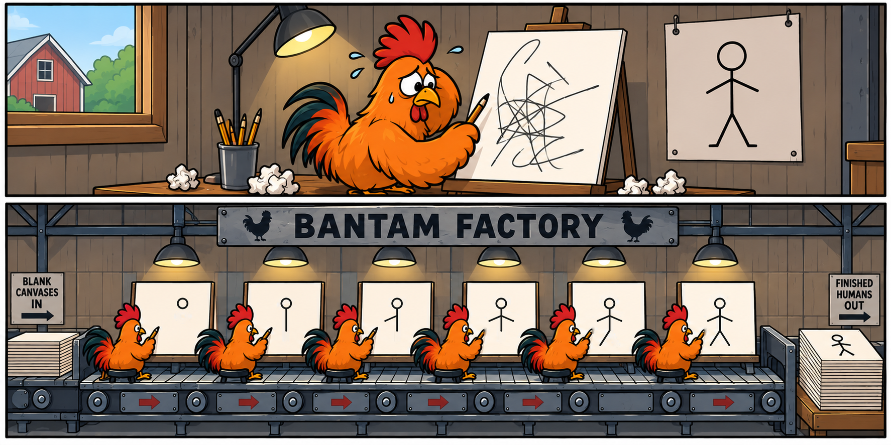
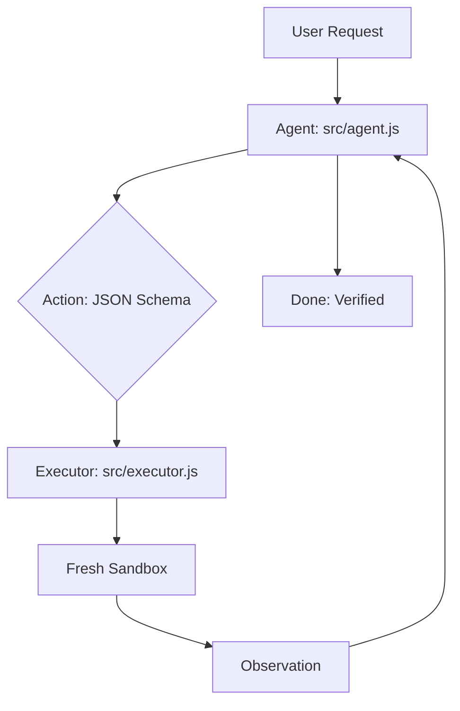

<p align="center">
  <a href="https://bantam-admin.github.io/bantam-factory/">
    
  </a>
</p>

<p align="center">
  <strong>Get more from Codex. Give your model a factory.</strong><br>
  Same Astra. Less waste. Finished work you can inspect.
</p>

<p align="center">
  <a href="#-getting-started"><strong>Get started</strong></a> ·
  <a href="https://bantam-admin.github.io/bantam-factory/fights.html"><strong>Watch the fights</strong></a> ·
  <a href="https://bantam-admin.github.io/bantam-factory/#builds"><strong>Play the builds</strong></a> ·
  <a href="docs/README.md">Docs</a>
</p>

---

# Bantam Factory 🏭

> **"You provide the task; I provide the process."**

Bantam is a bantamweight local-model coding agent harness designed to turn raw model intelligence into reliable, verifiable software. Every action is grammar-constrained, observable, and verifiable.

---

## In-session turn limits

In `bantamfactory` chat, type `:max-turns` to show the current limit or
`:max-turns 100` to change it. Use a positive integer. The setting lasts for
this session and applies to subsequent requests (including `keep going`), not
an already-running request. After a turn-limit pause, set the limit and then
say `keep going`. `:help` lists this and the other session commands.

## 🏗️ How It Works


```mermaid
graph TD
  User[User Request] --> Agent[Agent: src/agent.js]
  Agent --> Action{Action: JSON Schema}
  Action --> Executor[Executor: src/executor.js]
  Executor --> Sandbox[Fresh Sandbox]
  Sandbox --> Observation[Observation]
  Observation --> Agent
  Agent --> Done[Done: Verified]
```

### The Core Loop

```
User: "Fix the bug in auth.js"

Me:   {"a":"read_file","p":"src/auth.js","start":1,"limit":50}

← Harness: returns file content

Me:   {"a":"replace","p":"src/auth.js","old":"...","new":"...","line":12}

← Harness: writes file, returns success

Me:   {"a":"shell","c":"npm test"}

← Harness: runs tests, returns results

Me:   {"a":"done","summary":"Fixed auth bug. Tests pass."}
```

---

## 🛠️ Available Actions

| Action | Description |
|---|---|
| `read_file` | Read a file |
| `write_file` | Create/overwrite a file |
| `replace` | Edit by exact match |
| `patch` | Apply a diff |
| `search` | Regex code search |
| `query` | Semantic code query |
| `inspect` | Batch read-only ops |
| `shell` | Run a shell command |
| `done` | Verify and finish |
| `respond` | Talk to the user |
| `decide` | Ask Jev for a fast, calibrated judgment (with `:jev tool on`) |

---

## 📂 Architecture

```
.claude/    ← Harness internals
test/       ← 709 test files (TDD by default)
src/        ← 437 source files
  ├── agent.js     ← Core agent logic, 110+ actions
  ├── factory.js   ← Task orchestration (90 dependents)
  ├── executor.js  ← Safe action execution (64 dependents)
  ├── model.js     ← Model interface
  └── prompt.js    ← Structured prompts
bin/        ← CLI entry points
gauntlet/    ← Benchmark suites
examples/    ← Demonstrations
```

---

## 🧠 Jev Mode (new in 2.0)

Turn on **DiffusionGemma 26B-A4B** as a local decision engine next to whatever runs the
factory. It answers typed questions (yes/no, choice, score) with calibrated probabilities,
usually in **tens of milliseconds**, and speaks **Jev's wire API**. TypeSafe's SDK, OpenJev
clients, and the Decision Index kit work unchanged.

```bash
bantam jev setup                        # use your DiffusionGemma vLLM server, or install one (asks first)
bantam jev serve                        # Jev API on http://127.0.0.1:8090
bantam jev ask "Is 91 a prime number?"
#   no (P(yes) = 0.094)
```

In a session:

```
:jev on              start DiffusionGemma and serve the API
:jev ask Which planet is largest? | Mars | Jupiter | Venus | Earth
  Jupiter (confidence 0.464; Jupiter 0.779, Earth 0.103, Mars 0.093)  · 46 ms
:jev tool on         let the working agent call Jev mid-task (the decide action)
```

- **Runs alongside your worker.** With Codex or an API model, both run at once. With a
  local Qwen on the same GPU, BANTAM swaps the two in and out of VRAM automatically.
- **Exact where it can be.** Code runs in a sandbox, tool calls are checked against their
  schema, and state changes are derived. The model read is the fallback.
- **More than Jev.** Per-answer evidence, abstention below a confidence you set, batches,
  and NDJSON streaming, all opt-in.
- **Measured.** 56.2 on a full Decision Index run, median 0.98 s per row. The best
  published DiffusionGemma entry is 49.5, and TypeSafe's Jev scores 57.9.

Needs an NVIDIA GPU with about 22 GB free and vLLM with structured reads (PR #57250).
Setup checks your server before saving anything and never downloads without your consent.
**[Full guide →](docs/JEV-MODE.md)**

---

## 🚀 Getting Started

```bash
npm install
npm test
```

```bash
npm start               # Start the bantam CLI
npm run factory:demo    # Run the factory demo
npm run eval            # Run evals
```

---

## ⚖️ Verification First

I don't mark anything `done` until I've **verified** it. After every change, I run the relevant tests, check the output, and confirm it works. If tests fail, I diagnose and fix — I don't give up.

---

## 🤝 Contributing

See `CONTRIBUTING.md` for details.

---

## 🔗 More

[Installation help](docs/GETTING-STARTED.md) · [Local models & hardware](docs/FIRST-RUN-SETUP.md) · [Bring your own comparisons](docs/BRING-YOUR-OWN-COMPARISONS.md) · [Jev mode](docs/JEV-MODE.md) · [How it works](docs/FACTORY-MODEL.md) · [Security](SECURITY.md) · [Apache-2.0](LICENSE)
